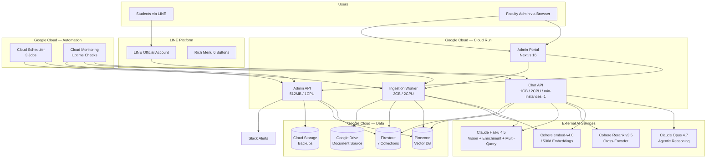
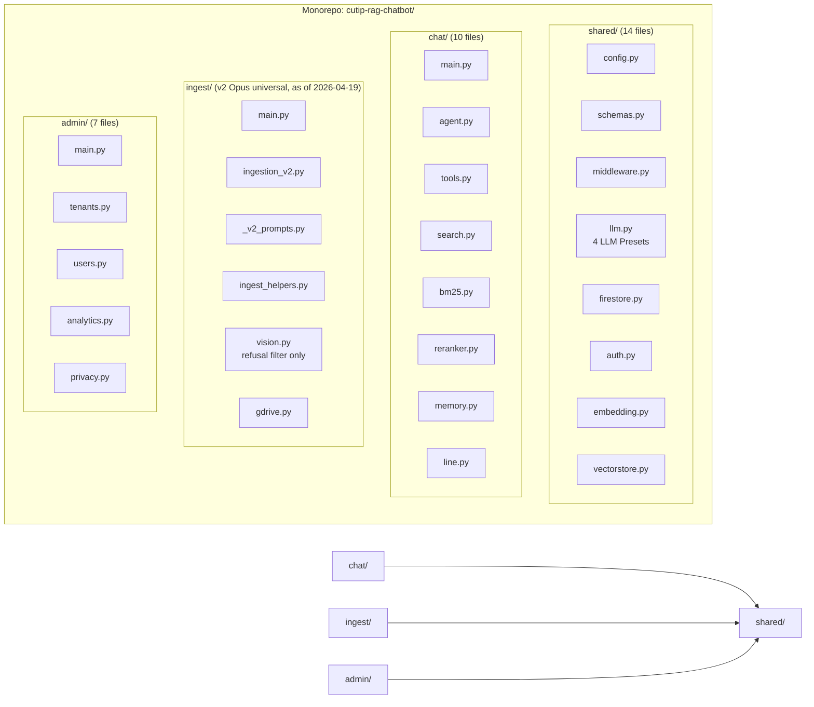
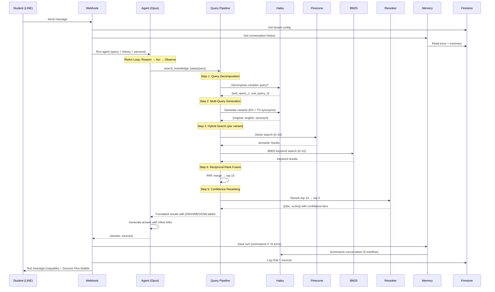
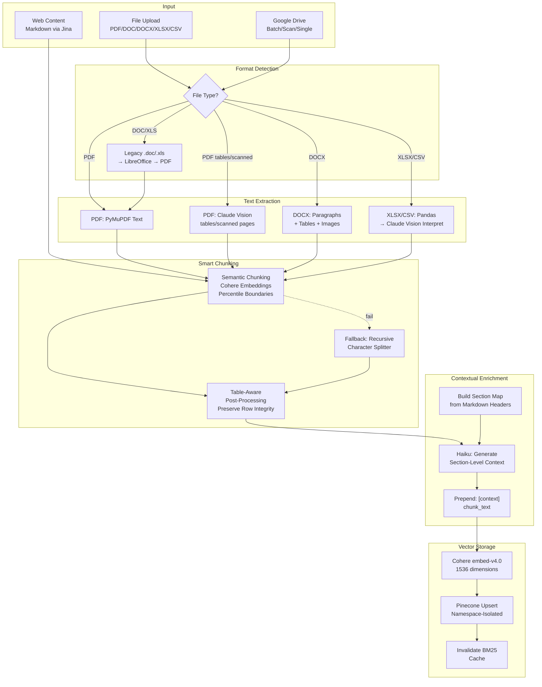
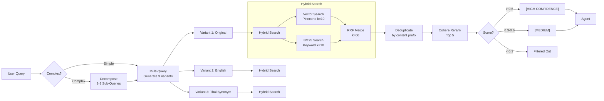
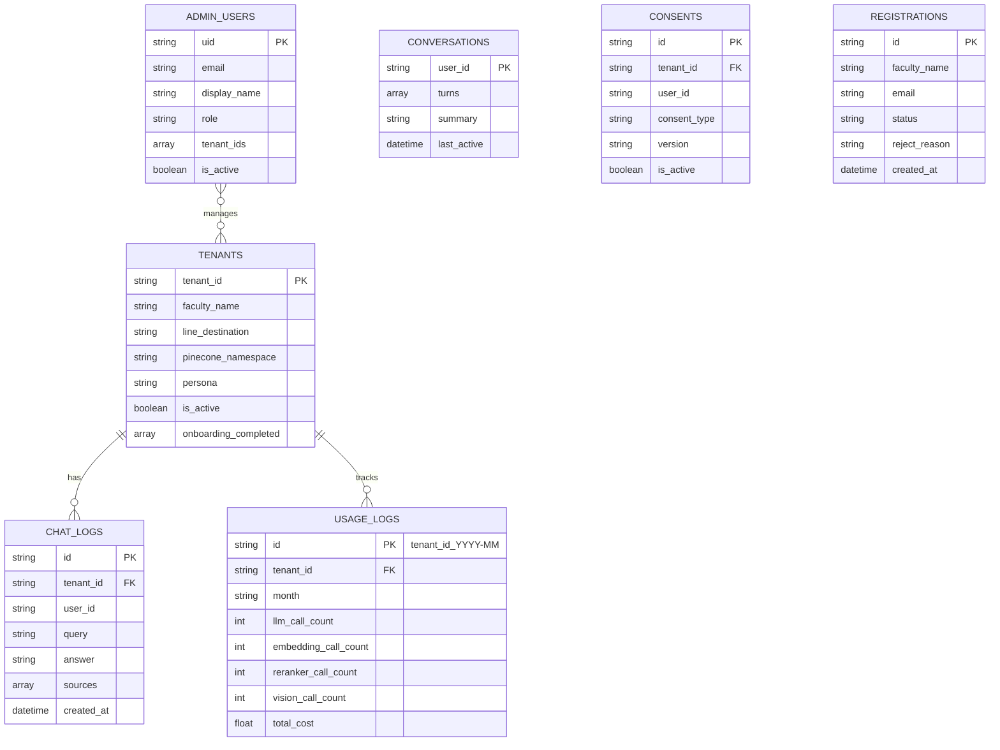
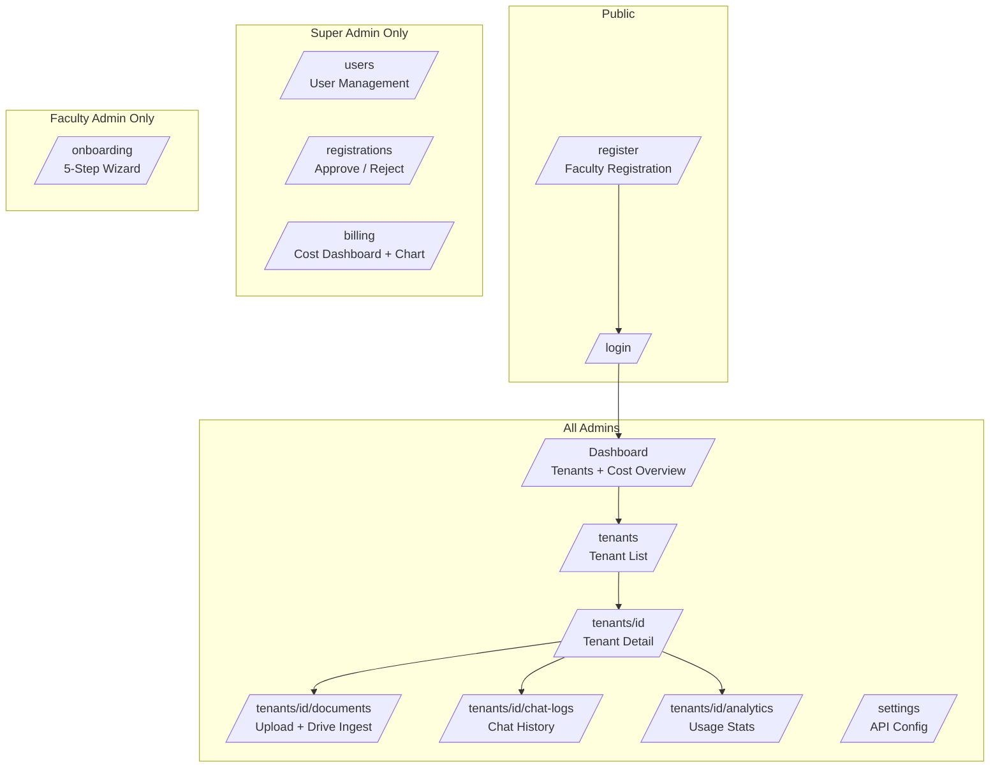
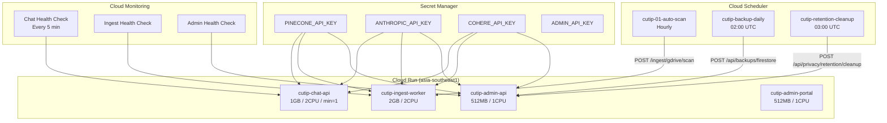
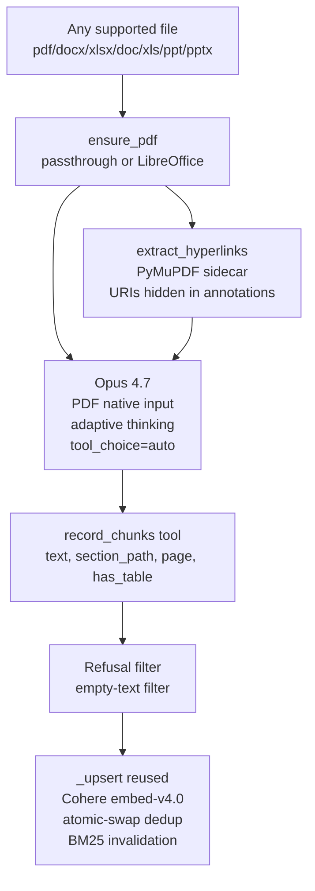

# CU TIP RAG Chatbot — Architecture Document

**Version:** 4.2.0 | **Date:** 2026-04-18 | **Status:** Production (v1) + Pilot (v2 universal ingestion)

---

## 1. System Overview

---

## 2. Microservices Architecture

| Service | Responsibility | Resources | Instances |
|---------|---------------|-----------|-----------|
| **Chat API** | LINE webhook, /api/chat, agentic RAG | 1GB, 2CPU | min=1, max=10 |
| **Ingestion Worker** | Document processing, Pinecone upsert | 2GB, 2CPU | 0-2 |
| **Admin API** | CRUD, analytics, backup, privacy | 512MB, 1CPU | 0-2 |
| **Admin Portal** | Web UI (Next.js 16 + shadcn/ui) | 512MB, 1CPU | 0-2 |

---

## 3. Chat Pipeline (Student Query Flow)

---

## 4. Ingestion Pipeline (Document Processing)

### Chunking Strategy

| Input Type | Text Extraction | Chunking | Enrichment |
|-----------|----------------|----------|------------|
| PDF (text-heavy) | PyMuPDF | Semantic | Section-level Haiku |
| PDF (tables/scanned) | Claude Vision | Semantic | Section-level Haiku |
| PDF (slides) | PyMuPDF/Vision | Page-level | Section-level Haiku |
| DOCX | python-docx + Vision (images) | Semantic | Section-level Haiku |
| XLSX/CSV | Pandas → Vision interpret | Semantic | Section-level Haiku |
| Markdown | Direct | Semantic | Section-level Haiku |
| Legacy (.doc/.xls) | LibreOffice → PDF → above | Same as PDF | Same as PDF |

---

## 5. Search Pipeline (God Mode)

---

## 6. Data Model (Firestore)

---

## 7. Admin Portal

---

## 8. Infrastructure

---

## 9. Tech Stack Summary

| Layer | Technology | Purpose |
|-------|-----------|---------|
| **LLM** | Claude Opus 4.7 | Agentic reasoning (ReAct agent) |
| **LLM** | Claude Haiku 4.5 | Vision, enrichment, multi-query, summarization |
| **Embedding** | Cohere embed-v4.0 | 1536d document/query vectors |
| **Reranker** | Cohere Rerank v3.5 | Cross-encoder precision ranking |
| **Chunking** | SemanticChunker | Embedding-based boundary detection |
| **Vector DB** | Pinecone | Namespace-isolated vector storage |
| **Keyword Search** | rank-bm25 | BM25Okapi for exact term matching |
| **Backend** | FastAPI + Uvicorn | 3 async microservices |
| **Frontend** | Next.js 16 + shadcn/ui | Admin portal (14 pages) |
| **Auth** | Firebase Auth | Email/password + JWT tokens |
| **Database** | Firestore | 7 collections (config, logs, users) |
| **Chat** | LINE Messaging API | Webhook + Rich Menu + Flex Messages |
| **Storage** | Google Cloud Storage | Backup exports |
| **Documents** | Google Drive API | Source document management |
| **Scheduler** | Cloud Scheduler | 3 automated jobs |
| **Monitoring** | Cloud Monitoring + Slack | Uptime checks + error alerts |
| **Deploy** | Cloud Build + Cloud Run | Container-based deployment |
| **Testing** | pytest + Vitest | 279 tests (250 BE + 29 FE) |

---

## 10. Key Design Decisions

| Decision | Choice | Rationale |
|----------|--------|-----------|
| LLM for agent | Claude Opus 4.7 | Best reasoning quality for agentic RAG |
| LLM for v2 parse+chunk | Claude Opus 4.7 w/ adaptive thinking | Universal ingestion — PDF native, tool-output JSON, thinking-aware for long/dense docs |
| LLM for utilities | Claude Haiku 4.5 | 60x cheaper, sufficient for summarize/enrich |
| Search strategy | Hybrid BM25+Vector+RRF | Catches both semantic and keyword queries |
| Chunking | Semantic (embedding-based) | 30-40% better retrieval than fixed-size |
| Enrichment | Section-level context | 60% improvement over global doc summary |
| Architecture | Microservices monorepo | Independent scaling, shared code package |
| Chat min-instances | 1 (always warm) | Avoid LINE webhook timeout on cold start |
| Memory | Summarization (Haiku) | Unlimited effective conversation context |
| Confidence | 3-tier (HIGH/MEDIUM/filtered) | Prevents low-relevance hallucination |

---

## 11. Ingestion v2 — Universal Opus 4.7 Pipeline (Pilot)

**Status:** Deployed on Cloud Run `cutip-ingest-worker-00019-7vr` as a parallel endpoint. v1 (§4) remains the production path; v2 is validated via the isolated `cutip_v2_audit` Pinecone namespace.

### 11.1 Motivation

The v1 pipeline (§4) accumulated 9 months of rule-based special-casing (format dispatcher × 5 paths, `has_tables → Vision` routing, `is_slides → page-chunk`, refusal-pattern filters, table-boundary repair, atomic-swap dedup). Each new complex-document shape required a new `elif` branch. v2 replaces the accretion with **one universal path** driven by Opus 4.7's multimodal understanding — new document shapes become prompt-tuning concerns, not new code branches.

### 11.2 Architecture

### 11.3 Key Design Choices

| Decision | Choice | Rationale |
|----------|--------|-----------|
| Universal vs per-format | Universal (ensure_pdf → Opus) | 1 code path vs 5; new shapes handled via prompt, not code |
| Tool use | `tool_choice={"type": "auto"}` + system-prompt instruction | Auto unlocks adaptive thinking (forced tool use disables it). Thinking was empirically required for 45-page slide decks (0 chunks → 43 chunks) |
| Output tokens | `max_tokens=32000` | 8K truncated the `record_chunks` JSON array mid-stream on dense docs (23-student announcement: 0 → 25 chunks after bump) |
| Sidecar metadata | Deterministic `extract_hyperlinks()` | Opus renders PDFs visually; link-annotation URIs (not visible text) must be pre-extracted. Skips URIs already plain in text to avoid duplication |
| Namespace override | Query param on `/v2/gdrive`, suffix-validated `_v2_audit` | Audit runs into an isolated namespace without creating a fake tenant |
| Format expansion | `libreoffice-core writer calc impress` in Dockerfile | v1 had writer only; v2's universal path requires calc (.xlsx) and impress (.pptx) |

### 11.4 Endpoints

| Method | Path | Purpose |
|--------|------|---------|
| POST | `/api/tenants/{tenant_id}/ingest/v2/gdrive` | Batch ingest a Google Drive folder via v2 |
| POST | `/api/tenants/{tenant_id}/ingest/v2/gdrive/file` | Single-file retry (for transient GDrive download flakes) |

Both accept `?namespace_override=<name>_v2_audit` for isolated audit runs.

### 11.5 v2 Audit Result (Phase-1, 2026-04-18)

Ingested 14 sample documents from `sample-doc/cutip-doc/` into namespace `cutip_v2_audit`:

| File | Chunks (v2) | Notes |
|------|-------------|-------|
| slide.pdf (45 pages) | 43 | v1 dropped to 0 without thinking; 1 chunk/slide after fix |
| ประกาศแจ้งคณะกรรมการสอบ.pdf | 25 | 23 student records + 2 structural chunks (vs v1's 14) |
| สอบโครงการพิเศษ.pdf | 13 | |
| ตารางเรียน ปี 2568.xlsx | 11 | LibreOffice-calc → PDF → Opus |
| ตารางเรียน-ห้องเรียน.xlsx | 8 | |
| docx-form.docx | 8 | |
| doc-form.doc | 8 | LibreOffice-writer path |
| สอบโครงร่างวิทยานิพนธ์.pdf | 7 | |
| สอบวิทยานิพนธ์.pdf | 7 | |
| xlsx-table.xlsx | 4 | |
| annouce.pdf | 4 | |
| สอบความก้าวหน้าวิทยานิพนธ์.pdf | 4 | |
| pdf-form.pdf | 6 | Checkbox detection works without Form Parser |
| ทุนการศึกษา.docx | 1 | Short doc, single chunk appropriate |
| **Total** | **149** | **14 files, zero vision-error / refusal chunks** |

Net LOC delta (v1 → v2, *if v2 replaces v1*): **–1100 / +250 ≈ −85% ingestion surface**.

### 11.6 Rollout (completed 2026-04-19)

v2 is now the sole ingestion pipeline. v1 archived in the `legacy` branch.

1. Phase-1 audit (2026-04-18): v2 entity coverage 24/24 Thai names, 23/23 student IDs, 2/2 emails — on par with v1 ✓
2. Phase-2: skipped — single-tenant deployment, no feature flag needed
3. Phase-3 cutover: all routes (`/document`, `/spreadsheet`, `/gdrive`, `/gdrive/scan`, `/gdrive/file`) now thin-wrap `ingest_v2()` — 2026-04-19
4. Phase-4 (completed 2026-04-19): v1 dispatchers + helpers deleted. Removed: `ingest_pdf`, `ingest_docx`, `ingest_markdown`, `ingest_legacy`, `ingest_spreadsheet`, `_smart_chunk`, `_fix_table_boundaries`, `_chunk_pages`, `_enrich_with_context`, `parse_page_image`, `interpret_spreadsheet`, format dispatcher, chunking.py, enrichment.py. Shared helpers kept in renamed `ingest_helpers.py`: `_build_metadata`, `_convert_to_pdf`, `_delete_existing_vectors`, `_upsert`.

Spec: `docs/superpowers/specs/2026-04-18-ingest-v2-design.md`
Plan: `docs/superpowers/plans/2026-04-18-ingest-v2.md`
Legacy branch (v1 reference): `legacy`
