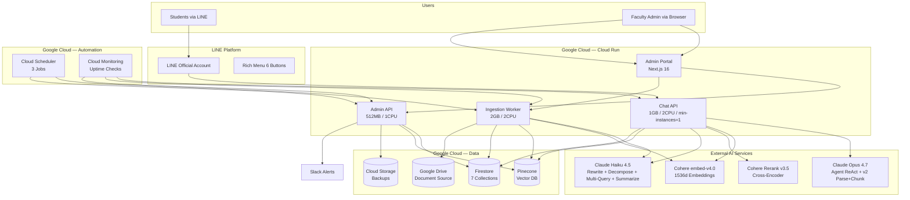
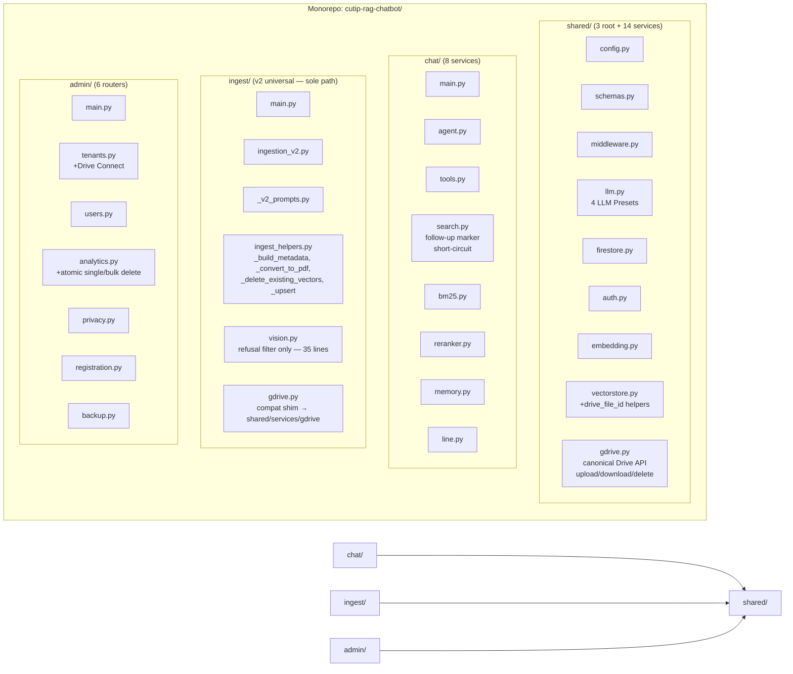
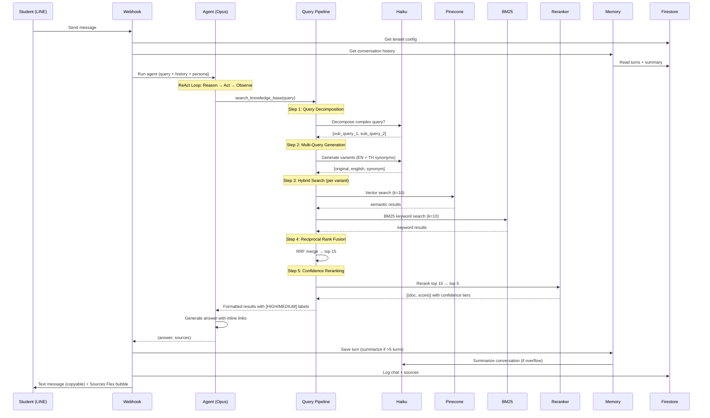
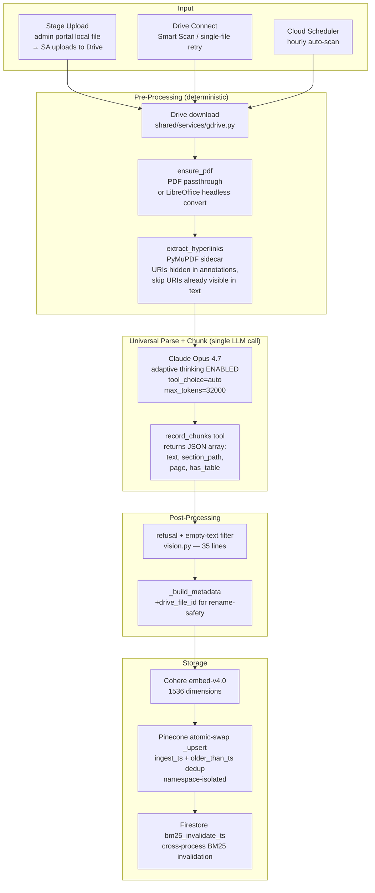
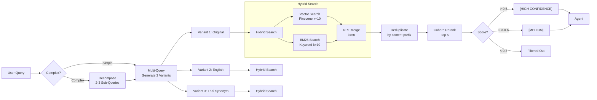
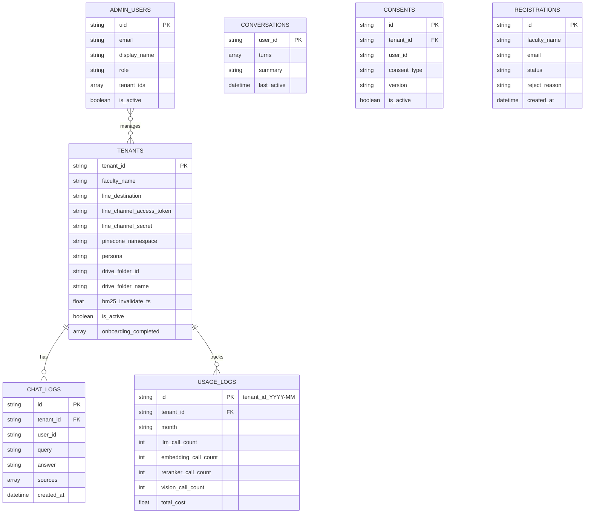
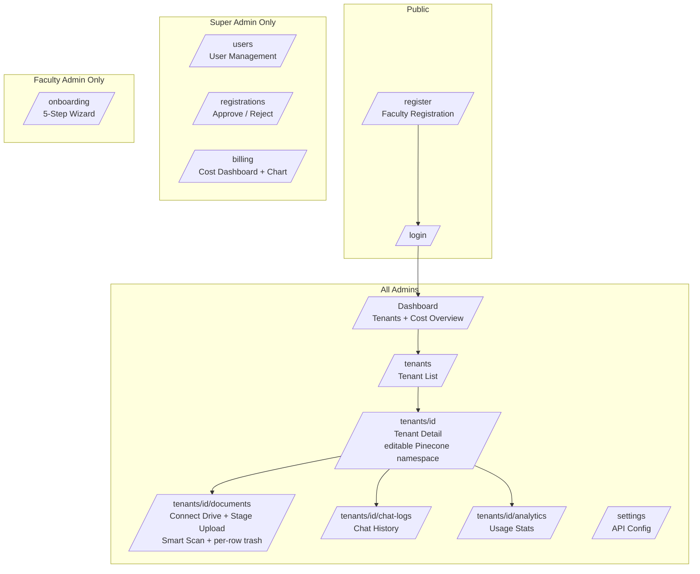
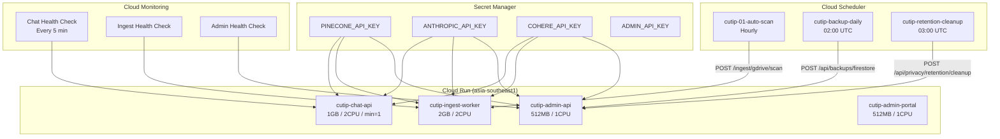
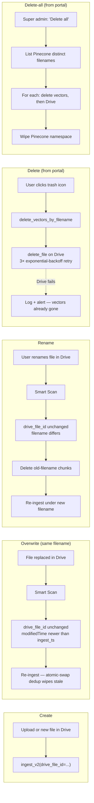
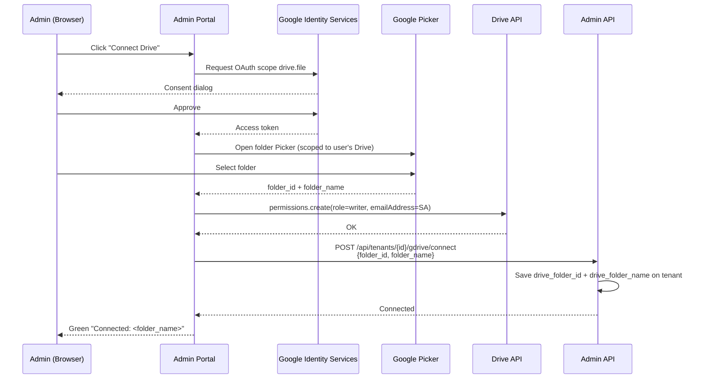

# VIRIYA (วิริยะ) — Architecture Document

**Product:** VIRIYA — *Relentlessly Relevant.* (formerly "CU TIP RAG Chatbot")
**Version:** 5.0.0 | **Date:** 2026-04-20 | **Status:** Production (v2 universal ingestion — sole path, post-cutover)

> This document describes the system as-deployed after the 2026-04-19 v2 cutover and the 2026-04-20 VIRIYA rebrand. The v1 rule-based multi-format ingestion pipeline is retained for thesis reference in the `legacy` git branch only; it is no longer part of the runtime architecture.

---

## 1. System Overview

---

## 2. Microservices Architecture

| Service | Responsibility | Resources | Instances |
|---------|---------------|-----------|-----------|
| **Chat API** | LINE webhook, /api/chat, agentic RAG | 1GB, 2CPU | min=1, max=10 |
| **Ingestion Worker** | Document processing, Pinecone upsert | 2GB, 2CPU | 0-2 |
| **Admin API** | CRUD, analytics, backup, privacy | 512MB, 1CPU | 0-2 |
| **Admin Portal** | Web UI (Next.js 16 + shadcn/ui) | 512MB, 1CPU | 0-2 |

---

## 3. Chat Pipeline (Student Query Flow)

---

## 4. Ingestion Pipeline (Universal v2, Opus 4.7)

As of 2026-04-19 all ingestion runs through a single universal path — `ingestion_v2.py::ingest_v2()`. Format-specific v1 code (PDF/DOCX/XLSX/markdown/legacy dispatchers, semantic chunker, table-boundary repair, hierarchical enrichment, spreadsheet Vision interpreter) was removed and is retained only in the `legacy` git branch. §11 preserves the evolution narrative.

### 4.1 Flow

### 4.2 Why Universal

The v1 pipeline accumulated nine months of rule-based special-casing — `has_tables → Vision` routing, `is_slides → page-chunk`, table-boundary repair, per-format dispatchers, section-level Haiku enrichment. Each new complex-document shape required a new `elif` branch and a new test fixture. v2 replaces the accretion with **one universal path** driven by Opus 4.7's multimodal understanding: Opus renders the PDF visually, reads the sidecar of hidden hyperlink URIs, and emits section-tagged chunks directly through the `record_chunks` tool. New document shapes become prompt-tuning concerns, not new code branches. §11 retains the empirical justification (chunk-count deltas, format coverage, LOC reduction).

### 4.3 Supported Inputs

| Input | Entry Point | Notes |
|-------|-------------|-------|
| Stage Upload (admin portal local file) | `POST /api/tenants/{id}/ingest/stage` | SA uploads local file → Drive folder → `ingest_v2(webViewLink)` |
| Drive Smart Scan | `POST /api/tenants/{id}/ingest/gdrive/scan` | Scan-all mode: NEW / RENAME / OVERWRITE / SKIP via `drive_file_id` + `modifiedTime` |
| Drive batch ingest | `POST /api/tenants/{id}/ingest/gdrive` | Thin-wrapper over v2 for the whole folder |
| Single-file retry | `POST /api/tenants/{id}/ingest/gdrive/file` | Re-ingest one file (transient Drive flake recovery) |
| Scheduled auto-scan | Cloud Scheduler → `/gdrive/scan` | Hourly |

File-type coverage (delegated entirely to `ensure_pdf` + Opus multimodal):

| Extension | Pre-processing |
|-----------|----------------|
| `.pdf` | passthrough |
| `.docx`, `.doc` | LibreOffice-writer → PDF |
| `.xlsx`, `.xls` | LibreOffice-calc → PDF (requires `fonts-thai-tlwg` for Thai glyphs) |
| `.pptx`, `.ppt` | LibreOffice-impress → PDF |

### 4.4 Rename-Safe + Overwrite-Safe Semantics

Every chunk stores `drive_file_id` in its metadata. This turns the ingestion layer into a two-key dictionary:

- **`source_filename`** — human-readable identifier shown in the portal and as the source badge in LINE replies.
- **`drive_file_id`** — stable identifier that survives user renames.

Consequences (detailed in §12):

- **Rename in Drive** → Smart Scan detects `drive_file_id` unchanged + `source_filename` changed → deletes old-name chunks + re-ingests under new name.
- **Overwrite in Drive** (same filename, new content) → Smart Scan detects `drive_file_id` unchanged + `modifiedTime` newer than last `ingest_ts` → re-ingests; atomic-swap dedup wipes stale chunks.
- **Delete from portal** → atomic: Pinecone `delete_by_filename` first, then Drive `delete_file` with 3× exponential-backoff retry.

---

## 5. Search Pipeline (God Mode)

---

## 6. Data Model (Firestore)

---

## 7. Admin Portal

---

## 8. Infrastructure

---

## 9. Tech Stack Summary

| Layer | Technology | Purpose |
|-------|-----------|---------|
| **LLM** | Claude Opus 4.7 | Agentic reasoning (ReAct agent) |
| **LLM** | Claude Haiku 4.5 | Vision, enrichment, multi-query, summarization |
| **Embedding** | Cohere embed-v4.0 | 1536d document/query vectors |
| **Reranker** | Cohere Rerank v3.5 | Cross-encoder precision ranking |
| **Chunking** | SemanticChunker | Embedding-based boundary detection |
| **Vector DB** | Pinecone | Namespace-isolated vector storage |
| **Keyword Search** | rank-bm25 | BM25Okapi for exact term matching |
| **Backend** | FastAPI + Uvicorn | 3 async microservices |
| **Frontend** | Next.js 16 + shadcn/ui | Admin portal (14 pages) |
| **Auth** | Firebase Auth | Email/password + JWT tokens |
| **Database** | Firestore | 7 collections (config, logs, users) |
| **Chat** | LINE Messaging API | Webhook + Rich Menu + Flex Messages |
| **Storage** | Google Cloud Storage | Backup exports |
| **Documents** | Google Drive API | Source document management |
| **Scheduler** | Cloud Scheduler | 3 automated jobs |
| **Monitoring** | Cloud Monitoring + Slack | Uptime checks + error alerts |
| **Deploy** | Cloud Build + Cloud Run | Container-based deployment |
| **Testing** | pytest + Vitest | 266 tests (237 BE + 29 FE) |

---

## 10. Key Design Decisions

| Decision | Choice | Rationale |
|----------|--------|-----------|
| Agent LLM | Claude Opus 4.7 | Best reasoning quality for agentic ReAct loop; Thai-fluent |
| Ingestion parse+chunk | Claude Opus 4.7 (adaptive thinking, `tool_choice=auto`) | Universal path — PDF native, sidecar-aware, thinking-required for long/dense docs (45-page slide deck: 0 chunks without thinking → 43 with) |
| Utility LLM | Claude Haiku 4.5 | 60× cheaper; sufficient for rewrite/decompose/multi-query/summarize |
| Chunking | Opus-emitted (section-tagged) | Model emits already-contextualized chunks; removed v1's semantic chunker + table repair + Haiku enrichment |
| Search | Hybrid BM25 + Vector + RRF | Catches both semantic and keyword queries |
| Rewriter | Follow-up marker short-circuit | Prevents "ดาวน์โหลด/ฟอร์ม/เกณฑ์" qualifier injection on plain Thai noun queries (demo-day bug) |
| Confidence | 3-tier (HIGH/MEDIUM/filtered) | Prevents low-relevance hallucination |
| Architecture | Microservices monorepo | Independent scaling; shared/ package avoids duplication |
| Chat min-instances | 1 (always warm) | Avoid LINE webhook timeout on cold start |
| Memory | Summarization (Haiku) | Unlimited effective conversation context |
| File identity | `drive_file_id` in chunk metadata | Rename-safe delete; overwrite detection via modifiedTime |
| Delete order | Pinecone first, then Drive (3× retry) | Avoid orphan chunks causing "ghost" answers; Drive-before-Pinecone would make failure mode worse |
| Drive-as-source-of-truth | Connect Drive + Stage Upload + Smart Scan | Users own the files; the bot indexes them |

---

## 11. Architectural Evolution — v1 → v2 → v2.1

This section preserves the evolution narrative for thesis reference. The runtime architecture (§4) is v2 universal. v1 lives only on the `legacy` git branch.

### 11.1 Motivation

The v1 pipeline accumulated nine months of rule-based special-casing:
- format dispatcher × 5 paths (pdf / docx / xlsx / legacy / markdown),
- `has_tables → Vision` routing,
- `is_slides → page-chunk`,
- refusal-pattern filters,
- table-boundary repair,
- semantic chunker (LangChain SemanticChunker),
- section-level Haiku enrichment (hierarchical context prepended to each chunk),
- atomic-swap dedup via `older_than_ts`.

Each new complex-document shape required a new `elif` branch + a new test fixture. In Q2 2026, three incidents surfaced the limit:

| Date | Incident | v1 behavior |
|------|----------|-------------|
| 2026-04-17 | Announcement PDF with 23 student records → chunks missing all 23 names | `has_tables → Vision` forced Haiku OCR, which dropped Thai names and emitted English refusal strings |
| 2026-04-17 | `slide.pdf` (45 pages) → 0 chunks | Per-page Vision split couldn't reconstruct slide-level context |
| 2026-04-18 | Next novel doc shape required another `elif` branch | Every new shape = new code branch + new test |

**Observation:** each fix taught the pipeline a rule that a capable multimodal LLM already knows. The architecture was doing the model's job badly.

### 11.2 v2 Design Principle

One universal path, driven by Opus 4.7's multimodal understanding. New document shapes become prompt-tuning concerns, not new code branches. The deterministic pre-processing is minimal: `ensure_pdf` (LibreOffice for non-PDF) + `extract_hyperlinks` (PyMuPDF sidecar for URIs hidden in link annotations that the model's visual render cannot see).

### 11.3 Key Design Choices

| Decision | Choice | Rationale |
|----------|--------|-----------|
| Universal vs per-format | Universal (`ensure_pdf → Opus`) | 1 code path vs 5; new shapes handled via prompt, not code |
| Tool use | `tool_choice={"type": "auto"}` + system-prompt instruction | Auto unlocks adaptive thinking (forced tool use disables it). Thinking empirically required for long/dense docs — 45-page slide deck: 0 → 43 chunks |
| Output tokens | `max_tokens=32000` | 8K truncated `record_chunks` mid-stream on dense docs — 23-student announcement: 0 → 25 chunks after bump |
| Sidecar metadata | Deterministic `extract_hyperlinks()` | Opus renders PDFs visually; annotation URIs aren't visible. Skips URIs already in text to avoid duplication |
| LibreOffice packages | `libreoffice-core writer calc impress` + `fonts-thai-tlwg` + `fc-cache` | v1 Dockerfile had writer only; XLSX/PPTX need calc/impress; Thai glyphs render as □ without `fonts-thai-tlwg` (causing 70% → 21% coverage drop on `ตารางเรียน.xlsx` until fixed) |

### 11.4 Phase-1 Empirical Audit (2026-04-18)

14 sample documents ingested into isolated namespace `cutip_v2_audit`:

| File | Chunks (v2) | Notes |
|------|-------------|-------|
| slide.pdf (45 pages) | 43 | v1 dropped to 0 without thinking; 1 chunk/slide after fix |
| ประกาศแจ้งคณะกรรมการสอบ.pdf | 25 | 23 student records + 2 structural (v1 produced 14) |
| สอบโครงการพิเศษ.pdf | 13 | |
| ตารางเรียน ปี 2568.xlsx | 11 | LibreOffice-calc → PDF → Opus (post-font-fix) |
| ตารางเรียน-ห้องเรียน.xlsx | 8 | |
| docx-form.docx | 8 | |
| doc-form.doc | 8 | LibreOffice-writer path |
| สอบโครงร่างวิทยานิพนธ์.pdf | 7 | |
| สอบวิทยานิพนธ์.pdf | 7 | |
| xlsx-table.xlsx | 4 | |
| annouce.pdf | 4 | |
| สอบความก้าวหน้าวิทยานิพนธ์.pdf | 4 | |
| pdf-form.pdf | 6 | Checkbox detection without Form Parser |
| ทุนการศึกษา.docx | 1 | Short doc, single chunk appropriate |
| **Total** | **148** | zero vision-error / refusal chunks; 24/24 Thai names, 23/23 student IDs, 2/2 emails preserved |

LOC delta: **–1100 / +250 ≈ −85% ingestion surface** (measured across removed v1 modules: dispatchers, `chunking.py`, `enrichment.py`, v1 portions of `vision.py` and `ingestion.py`).

### 11.5 Cutover (2026-04-19)

Executed in one day, bypassing the original 4-phase plan (Phase-2 feature flag was skipped — single-tenant deployment, no safety benefit).

| Step | Action |
|------|--------|
| 1 | All router endpoints (`/document`, `/spreadsheet`, `/gdrive`, `/gdrive/scan`, `/gdrive/file`) rewritten as thin wrappers over `ingest_v2()` |
| 2 | v1 modules deleted: `chunking.py`, `enrichment.py`; v1 helpers removed from `vision.py` (185 → 35 lines); `ingestion.py` renamed to `ingest_helpers.py` (now 215 lines, 4 shared helpers) |
| 3 | v1-only schemas removed: `IngestMarkdownRequest`, `IngestMetadata`, `ALLOWED_DOC_CATEGORIES` |
| 4 | v1 test files deleted; `test_ingestion_v2.py` + `test_scan_all.py` cover new surface |
| 5 | `legacy` branch created from pre-cutover commit for thesis reference |

### 11.6 Post-Cutover Evolution (2026-04-19 → 2026-04-20, v2.1)

The v2 universal pipeline unlocked a second wave of simplifications once the format-switching scaffolding was gone:

| Date | Change | Driver |
|------|--------|--------|
| 2026-04-19 | `drive_file_id` added to chunk metadata | User reported rename-then-delete leaves orphan vectors. Rename-safety now uses stable Drive ID, not filename |
| 2026-04-19 | Smart Scan = NEW / RENAME / OVERWRITE / SKIP | Scan-all compares `drive_file_id` + `modifiedTime` vs Pinecone; renames/overwrites auto-handled |
| 2026-04-19 | Atomic single-file + bulk delete | Admin portal trash-icon per-row; `delete_by_filename` in Pinecone then `delete_file` on Drive with 3× retry. Delete-all wipes both sides |
| 2026-04-19 | Editable Pinecone namespace in portal | Super admin can reassign a tenant to a different namespace (auto-bumps `bm25_invalidate_ts`) |
| 2026-04-19 | `shared/services/gdrive.py` promoted | Was `ingest/services/gdrive.py`; admin-api needed it for delete, so canonicalized into shared/ with ingest's file kept as compat shim |
| 2026-04-19 | Drive Connect flow (OAuth + Picker + SA share) | Replaces manual folder-id paste — super admin or faculty admin connects their Drive, Picker selects folder, SA auto-shared as Editor |
| 2026-04-19 | Stage Upload | Admin portal local-file upload goes via SA → Drive folder → `ingest_v2`; unifies all ingestion through Drive |
| 2026-04-19 | Rewriter short-circuit (no follow-up markers) | Demo-day bug: Haiku rewriter was injecting "ดาวน์โหลด/ฟอร์ม/เกณฑ์" qualifiers on plain Thai noun queries → zero_results on `ตารางเรียน`, `ประกาศ` |
| 2026-04-19 | LibreOffice `fonts-thai-tlwg` + `fc-cache` | XLSX coverage regression: Thai glyphs rendering as □ in PDF conversion → Opus vision saw boxes → 70% → 21% coverage on `ตารางเรียน.xlsx`. Font package fixed it |
| 2026-04-19 | `bm25_invalidate_ts` on tenant doc | Cross-process BM25 invalidation — chat-api reads the ts at query-time and re-warms its local BM25 cache if stale (single-process `@lru_cache` is insufficient across replicas) |
| 2026-04-20 | VIRIYA (วิริยะ) rebrand + logo | Product-naming finalization; admin portal, login, register pages swapped from shadcn Bot icon → VIRIYA icon mark SVG |

§12 and §13 detail the file-lifecycle and Drive-connect flows respectively.

Spec: `docs/superpowers/specs/2026-04-18-ingest-v2-design.md`
Plan: `docs/superpowers/plans/2026-04-18-ingest-v2.md`
Legacy branch (v1 reference): `legacy`

---

## 12. File Lifecycle Semantics

All documents flow through Google Drive as source-of-truth. The admin portal is a controller over Drive + Pinecone; both must stay in sync, which is non-trivial when users rename/overwrite files or when one side fails during a mutation.

### 12.1 Two-Key Identity

Every chunk in Pinecone carries two identifiers:

| Field | Purpose | Stability |
|-------|---------|-----------|
| `source_filename` | Human-readable name shown in portal + LINE source badges | Mutable (renames) |
| `drive_file_id` | Google Drive file ID | Stable across renames; unique per file |

Helpers in `shared/services/vectorstore.py`:
- `get_drive_file_id_for(namespace, source_filename) → str | None` — for rename-safe delete: look up Drive ID from current filename.
- `get_existing_drive_state(namespace) → dict[drive_file_id, {filename, ingest_ts}]` — for scan-all rename/overwrite detection.
- `delete_vectors_by_filename(namespace, source_filename) → int` — atomic per-file vector wipe.

### 12.2 Mutation Flows

### 12.3 Delete-Order Rationale

Delete is **Pinecone-first, Drive-second**. Reversing the order (Drive-first) produces a worse failure mode:

- **Pinecone-first, Drive fails:** file remains in Drive but no chunks reference it. Next Smart Scan re-ingests cleanly (treated as NEW). User sees the file is still there; no "ghost answer" risk.
- **Drive-first, Pinecone fails:** orphan chunks remain with `source_filename` pointing to a Drive file that doesn't exist. The agent can still retrieve these chunks and cite a dead link — a "ghost answer." No automatic recovery (Smart Scan doesn't see the file anymore).

The 3× exponential-backoff retry on `delete_file` covers transient Drive API failures without changing this order.

### 12.4 BM25 Cross-Process Invalidation

Every mutation path (ingest, delete, rename) writes `bm25_invalidate_ts = time.time()` on the tenant's Firestore doc. Chat-api reads this ts on each query and re-warms its in-process BM25 index if the cached ts is older. This is necessary because each Cloud Run instance has its own `@lru_cache`-backed BM25, and a chat replica that didn't see the ingest event would otherwise serve stale keyword hits. Testing coverage: `tests/test_ingestion_router.py` + `tests/test_scan_all.py`.

---

## 13. Google Drive Connect Flow

Before v2.1, connecting a faculty to its Drive folder required manually pasting a folder ID into a textbox and hoping the user had shared the SA as Editor. Support burden + error-prone. Post-v2.1:

Key properties:
- **`drive.file` scope** (not `drive`) — the SA can only see files the user explicitly shared with it via the Picker, not the user's whole Drive.
- **SA auto-share as Editor** — required for `upload_file` (Stage Upload) and `delete_file`.
- **Tenant doc** stores `drive_folder_id` + `drive_folder_name`; Smart Scan and Auto-Scan use `drive_folder_id`.
- **No manual folder-id paste** — eliminates the "I pasted the wrong ID" support ticket class.
